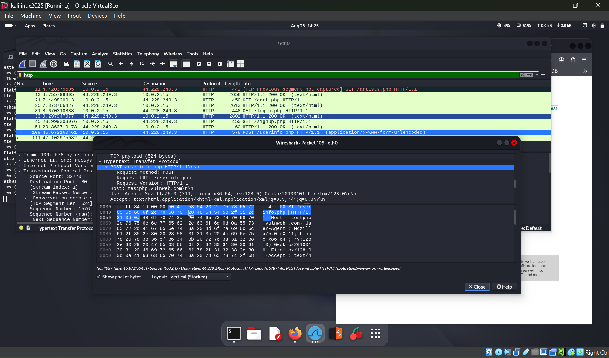
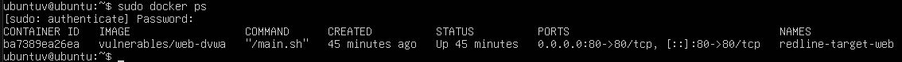
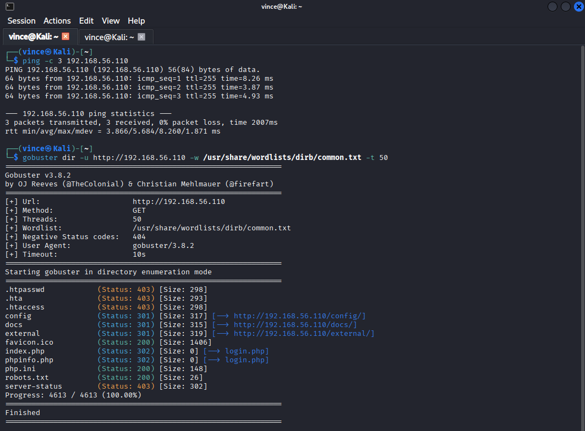
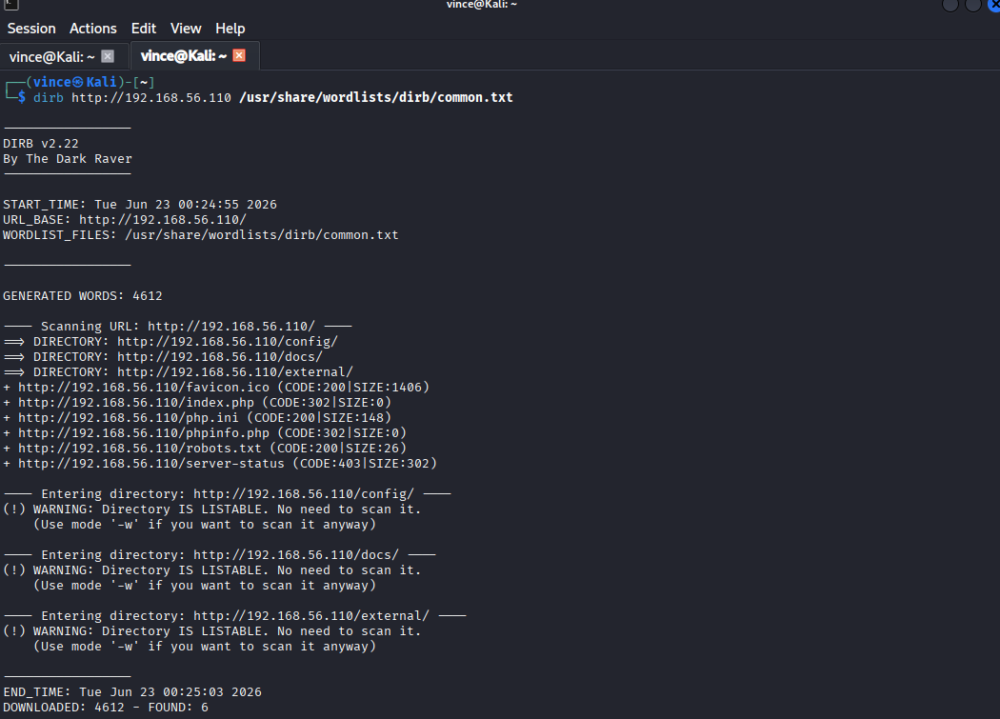
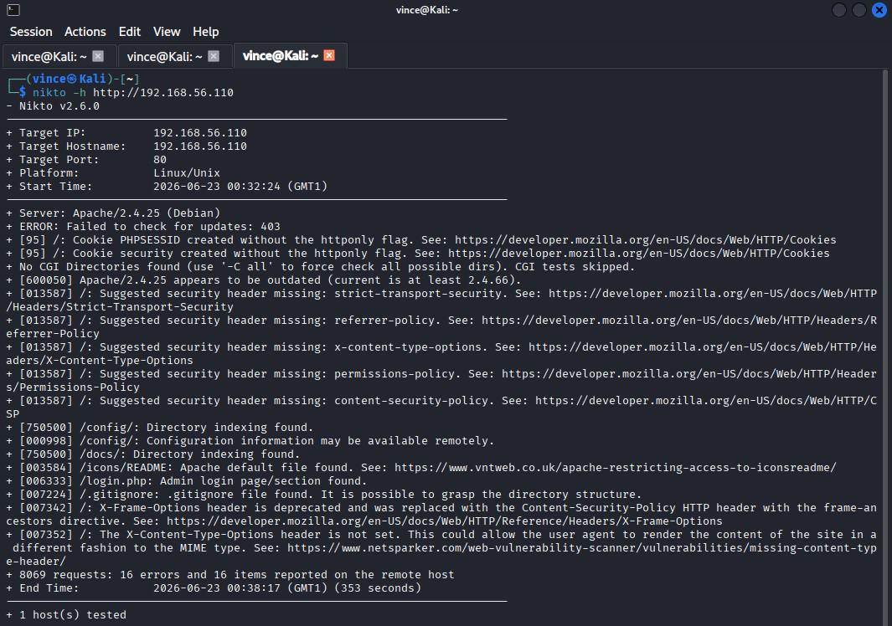
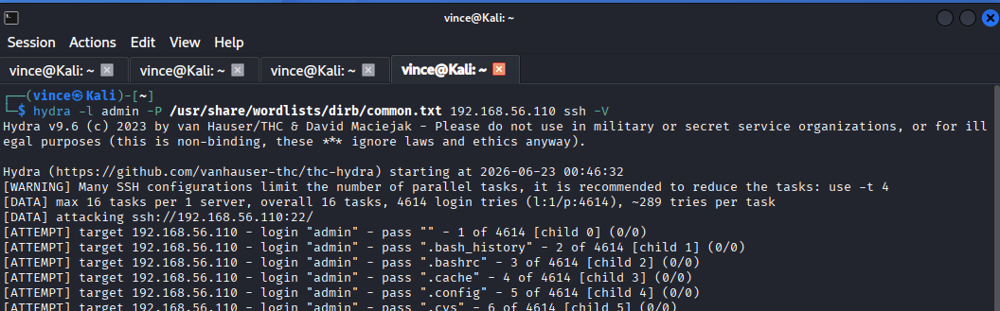
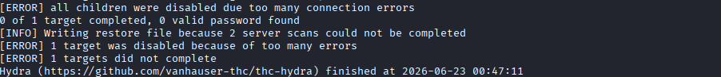

# Applied Penetration Testing Lab

## Nmap Scan

1. Target: [scanme.nmap.org](http://scanme.nmap.org).
2. Tool: Nmap (Aggressive Scan -A).
3. Technical Challenges and Troubleshooting:
   * **Issue Encountered:** During initial enumeration, the standard Nmap SYN scan (-sS) failed to return results, terminating with the error:

> Warning: 45.33.32.156 giving up on port because retransmission cap hit (10)

* **Root Cause Analysis:** The target system or an intermediate firewall (ISP level) was dropping unsolicited SYN packets. The scanner attempted to resend packets 10 times with no response, leading to a timeout. This behaviour indicates the presence of a stateless packet filter or an Intrusion Prevention System (IPS) blocking "half-open" connection attempts
* **Troubleshooting Strategy:** I switched from the default SYN scan to a TCP Connect Scan (-sT).
  * **Why it worked:** Unlike the stealthy SYN scan, the connect scan completes the full TCP 3-Way Handshake (SYN → SYN-ACK → ACK). This mimics the behaviour of a legitimate web browser or client, allowing the traffic to pass through the firewall inspection rules.
  * **Outcome:** The -sT scan successfully bypassed the filter, revealing open ports (22, 80, 9929) and allowing for subsequent Service Version Enumeration (-sV).
* **Key Findings:**
  * OS Identification: High probability of a Virtualized Linux environment (QEMU/VirtualBox).
  * Web Server: Apache 2.4.7 (Outdated).
  * SSH: OpenSSH 6.6.1p1 (Outdated).
  * Network Layout: High latency (1300ms+), requiring TCP Connect scans to maintain stability.

## Google Dork

1. Target: Ford ([ford.com](http://ford.com)) .
2. Tool: Google Advanced Search Operators (Dork), PaGoDo.
3. Query 1: site:[ford.com](http://ford.com) filetype:pdf “supplier”
   * Findings: I found public “Code of Conduct” documents and technical specifications for OFTP data transfer.
4. Query 2: site:[ford.com](http://ford.com) filetype:pdf “confidential”
   * Findings: I found documents that have “confidential” information.
5. Query 3: site:[ford.com](http://ford.com) filetype:pdf “internal use only”
   * Findings: I found documents that were classified as“internal use only” and may not be resold by vendors.
6. Query 4: site:[ford.com](http://ford.com) filetype:xlsx
   * Findings:
   * Exposed Staging Environments: I found several files on wwwqa (Quality Assurance) subdomains, showing that non-production environments are publicly indexed by search engines, which could expose test data or unpatched code.
   * Internal Process Documentation: I identified a “New Hire On-Boarding: spreadsheet publicly accessible. This poses a risk of Social Engineering attacks, as the file likely contains internal workflows and tool locations.
   * Business Intelligence Leak: I discovered a “Supplier Cost Breakdown: spreadsheet, which can potentially expose sensitive pricing strategies to competitors.

## **Wireshark**

1. Target: [testphp.vulnweb.com](http://testphp.vulnweb.com) (Authorized testing environment).
2. Tool: Wireshark.
3. Objective: To capture and inspect unencrypted HTTP POST requests to identify clear-text credentials.
4. Technical Challenges and Troubleshooting:
   * Issue Encountered: Network traffic was not recorded when the Wireshark capture was initiated, even though I was browsing the web using firefox on Kali.
   * **Root cause analysis:** I selected a disconnected ethernet adapter (eth0) rather than the active adapter with real time traffic (eth1).
   * **Troubleshooting Stage:** I terminated the current capture session, then I ran the “Ip a” command in my kali terminal to determine which adapter was the active one; I then noticed eth0 and eth1 both had inet connections but when I pinged google with each adapter specifically (using “ping -I eth0/eth1 [google.com](http://google.com)”), I was able to get the active adapter. I then restarted the capture session on the eth1 network adapter showing live traffic.
5. Process:
   * Initiated packet capture on eth,
   * Generated login traffic via Firefox browser,
   * Applied display filter: {http.request.method == “POST”} to isolate form submissions.

<figure><figcaption></figcaption></figure>

1. Key Findings:
   * Successfully intercepted the HTTP body.
   * Credential Exposure: Identification of fields “uname” and “pass” containing plaintext credentials.
   * Security Analysis: This shows the critical risk of using HTTP. It is mandatory to use SSL/TLS (HTTPS) encryption to prevent Man-in-the-Middle (MitM) attacks.

## Gobuster

* Target: `192.168.56.110` (Ubuntu target node / DVWA container)
* Tool: Gobuster
* Objective: Discover hidden directories and exposed scripts with a high-speed scan

#### Technical notes

* Issue: Initial requests timed out and scans showed `filtered` behavior.
* Root cause: pfSense rules restricted cross-subnet traffic into the DMZ.
* Fix: Moved the Kali VM and Ubuntu VM onto a shared Host-Only segment during testing.

> Lab note: This gave the attacker and target direct line-of-sight and removed the firewall from the path.

#### Process

* Verified the container state with `sudo docker ps`.
* Confirmed the Ubuntu interface address responded to `ping`.
* Ran Gobuster with `50` threads:

```bash
gobuster dir -u http://192.168.56.110 -w /usr/share/wordlists/dirb/common.txt -t 50
```

<figure><figcaption></figcaption></figure>

<figure><figcaption></figcaption></figure>

#### Key findings

* Rapidly mapped the application's top-level structure.
* Discovered explicit directory paths and server responses: `/config`, `/login.php` (Status 200 OK), and a nested directory index path at `/external/` (Status 301)

#### Security analysis

* Disable unnecessary directory listing.
* Add rate limiting and IP blocking for aggressive enumeration.
* Treat predictable admin paths as exposed attack surface.

## Dirb

* Target: `192.168.56.110` (Ubuntu target node / DVWA container)
* Tool: Dirb
* Objective: Compare recursive directory discovery against Gobuster

#### Technical notes

* Issue: The run took much longer than Gobuster.
* Root cause: Dirb pauses on discovered folders and builds nested work queues.

#### Process

* Launched Dirb against the target root web address re-using the common wordlist file:

```bash
dirb http://192.168.56.110 /usr/share/wordlists/dirb/common.txt
```

<figure><figcaption></figcaption></figure>

#### Key findings

* Successfully mapped out sub-directories automatically without requiring manual string inputs.
* Discovered nested application paths directly underneath the `/external/` directory structure.

#### Security analysis

* While slower, recursive scanners prove that security by obscurity (such as burying admin consoles deep within multiple subfolders) is ineffective against automated crawlers that dynamically parse discovered paths.

## Nikto

* Target: `192.168.56.110` (Ubuntu target node / DVWA container)
* Tool: Nikto
* Objective: Identify weak web server configuration and exposed version details

#### Technical notes

* Issue: Local `curl` checks returned `Connection refused` even though Docker was active.
* Root cause: The first container deployment crashed during MySQL initialization.
* Fix: Removed unstable containers with `sudo docker rm -f` and redeployed with `--restart always`.

#### Process

* Launched the web application scanner against the validated listening service:

```bash
nikto -h http://192.168.56.110
```

<figure><figcaption></figcaption></figure>

#### Key findings

* The server banner exposed `Apache/2.4.25 (Debian)`.
* `X-Frame-Options` was missing.
* `X-Content-Type-Options` was missing.

#### Security analysis

* The lack of security headers allows for UI redressing vulnerabilities (Clickjacking) and MIME-sniffing bypasses.&#x20;
* Version disclosures provide an advisory footprint that helps attackers pinpoint precise public exploits.&#x20;
* Server configuration profiles must be hardened to suppress banners.

## Hydra

* Target: `192.168.56.110` (Ubuntu target node / SSH)
* Tool: Hydra
* Objective: Test SSH password resilience with a common-wordlist attack

#### Technical notes

* Issue: The run processed `4,614` password candidates and found no valid password.
* Likely cause: The username and password pair was not present in the selected wordlist.

#### Process

* Ran an SSH attack against the local target using the common Dirb wordlist:

```bash
hydra -l admin -P /usr/share/wordlists/dirb/common.txt 192.168.56.110 ssh -V
```

<figure><figcaption></figcaption></figure>

<figure><figcaption></figcaption></figure>

#### Key findings

* Verified the network layer could successfully process massive amounts of rapid authentication traffic without exhausting system resource sockets or crashing the web container.
* No weak credential match appeared in the selected dataset.

#### Security analysis

* This assessment demonstrates that simple brute-force tool configurations can fail against dynamic forms. More importantly, it highlights the need for host defense layers to actively monitor log files for rapid password attempts and block offending IPs automatically.
